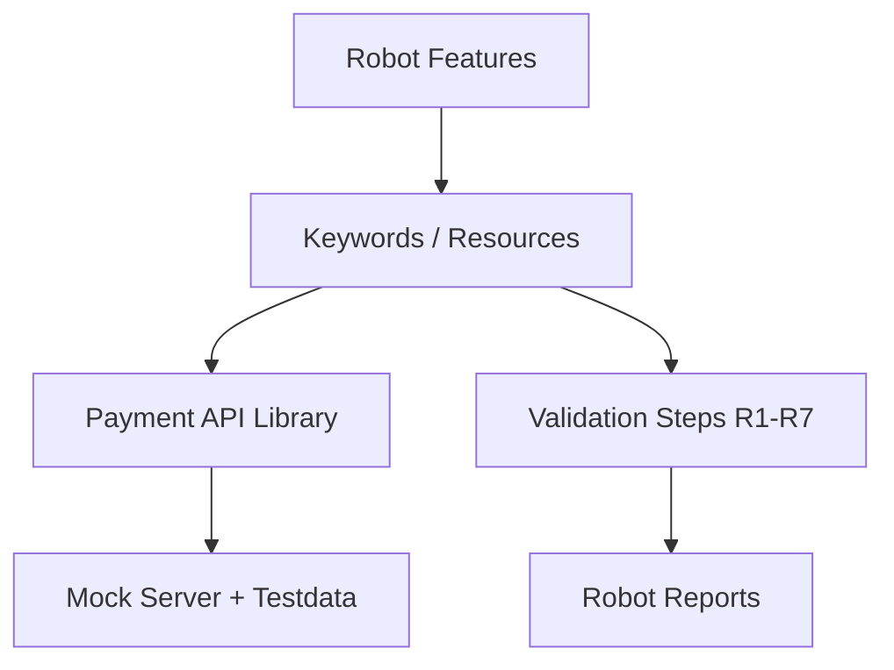

# Payment API Automation (Robot Framework)


Business-rule focused API automation suite for checkout payment workflows. Built to validate correctness, resilience, and release readiness.

## Why This Looks Senior

- Strong business-rule coverage with explicit R1–R7 validations
- Separation of concerns (`features`, `resources`, `steps`, `apis`)
- Deterministic mock-server strategy for stable CI runs
- Negative and edge-case design for production-risk prevention

## Architecture



## Test Strategy

- **Schema/contract checks:** Required fields and data types.
- **Business-rule checks:** Eligibility, defaults, price-type constraints.
- **Negative scenarios:** Missing fields, wrong types, non-success status, HTTP failures.
- **Deterministic data:** Controlled scenarios via testdata and query-based mocking.
- **CI gate:** Report/log artifacts for release decision support.

## Project Structure

```text
payment-api-robot/
├── features/
├── resources/
├── steps/
├── apis/
├── testdata/
├── mock_server.py
└── .github/workflows/robot.yml
```

## Setup

```bash
pip install -r requirements.txt
python mock_server.py
robot --outputdir results features/
```

## Security Notes

- Demo values are placeholders only.
- No real phone numbers, tokens, or credentials should be committed.
- Use local env/secret managers for sensitive runtime data.
